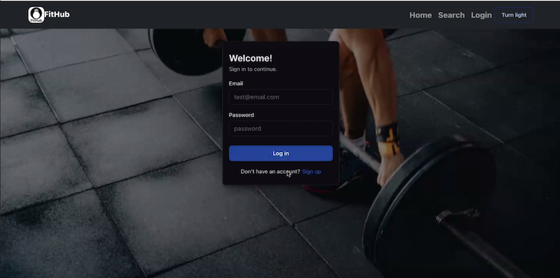
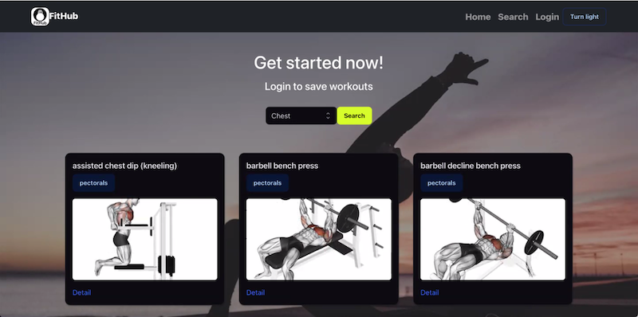
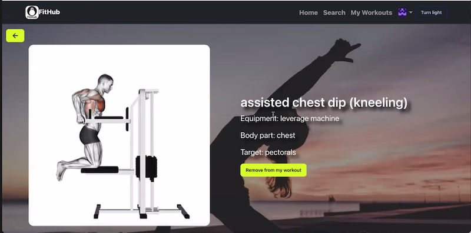
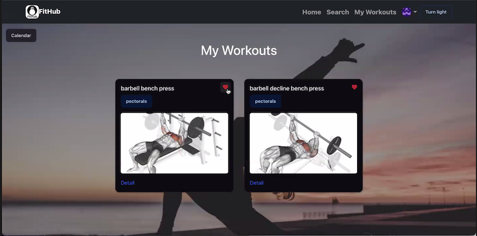
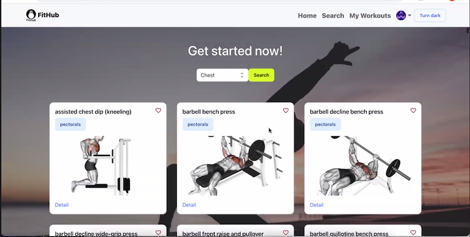

# FitHub

## Description

View deployed website:

The motivation for this app is for all users to find a fitness program and exercise that they can use, whether they are at home or at the gym to meet their fitness goals. Visualization helps demonstrates how to do the exercise correctly with written details for user to read and understand the exercises. This app solves the problem of figuring out what and how to do the exercise for certain body parts.

## Installation

What are the steps required to install your project? Provide a step-by-step description of how to get the development environment running.

## Usage

## Features

- Login/Logout
- Save Favorite workouts to "My Workouts"
- Dark/Light Mode

## Technologies Used

- React
- Redux
- Express
- GraphQL
- MongoDB
- JWT
- React State
- IndexedDB
- Local Storage

## How to Contribute

- Calendar add function to add workout completed/like that was done that day
- Setting page, email, account set-up
- Motivation board with weight, size, competition goal tracker
- Add more filters (ex. equipments)

## Credits

- [Christopher Saechao](https://github.com/TikoMyster)
- [RuxinQu](https://github.com/RuxinQu)
- [Richard Nelson](https://github.com/nelson92)
- [Lely Huynh](https://github.com/lely2011)

## License

This project is under [MIT license](https://opensource.org/lsicenses/MIT)
